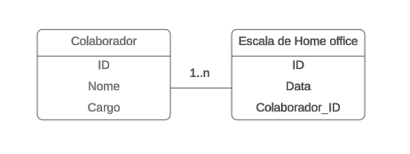

# Especificações do Projeto

Pré-requisitos: <a href="1-Documentação de Contexto.md"> Documentação de Contexto</a>

Definição do problema e ideia de solução a partir da perspectiva do usuário. É composta pela definição do  diagrama de personas, histórias de usuários, requisitos funcionais e não funcionais além das restrições do projeto.

Apresente uma visão geral do que será abordado nesta parte do documento, enumerando as técnicas e/ou ferramentas utilizadas para realizar a especificações do projeto

## Arquitetura e Tecnologias

o	Descreva brevemente a arquitetura definida para o projeto e as tecnologias a serem utilizadas. Sugere-se a criação de um diagrama de componentes da solução.

## Project Model Canvas

Colocar a imagem do modelo construído apresentando a proposta de solução.

> **Links Úteis**:
> Disponíveis em material de apoio do projeto

## Requisitos

As tabelas que se seguem apresentam os requisitos funcionais e não funcionais que detalham o escopo do projeto. Para determinar a prioridade de requisitos, foi aplicada a técnica de priorização da Escala de Três Níveis, que busca delimitar o universo de possíveis valores desse atributo para tais possibilidades, de modo que a prioridade seja uniformizada e melhor entendida por todos do time.

Foram estabelecidos os níveis de prioridade de acordo com os dois aspectos principais: importância e urgência. Assim, forma-se um quadrante, capaz de criar prioridades que combinem esses aspectos.

### Requisitos Funcionais

| ID   | Descrição do Requisito  | Prioridade |
|------|-----------------------------------------|----|
|RF-001| Deve existir um botão de "+" para adicionar um novo colaborador ao calendário. | ALTA |
|RF-002| Ao adicionar um novo colaborador, o sistema deve permitir informar apenas o nome e o setor, sem a necessidade de informações adicionais. | ALTA |
|RF-003| Os gestores devem poder criar e editar escalas de trabalho para os colaboradores. | ALTA | 
|RF-005| O sistema deve exibir as marcações da escala dos funcionários no calendário, com distinção clara entre os dias de jornada presencial e home office. | ALTA |
|RF-005| Deve haver um botão de "-" para remover um colaborador do calendário. | ALTA |
|RF-006| O sistema deve permitir a remoção de um colaborador com um único clique, sem confirmações adicionais. | ALTA |

### Requisitos não Funcionais
Os requisitos não funcionais não estão relacionados diretamente com os serviços específicos do sistema oferecidos aos seus usuários. Eles estão relacionados com o nível de serviço esperado para o melhor funcionamento do software como um todo. O descritivo abaixo representa o escopo não funcional que a plataforma atenderá:

| ID    | Descrição do Requisito  |Prioridade |
|-------|-------------------------|----|
|RNF-001| A interface do sistema deve ser extremamente simples e intuitiva, garantindo uma curva de aprendizado mínima. | ALTA |
|RNF-002| A adição e remoção de colaboradores deve ser realizada de forma rápida, sem exigir navegação por menus complexos. | ALTA |
|RNF-003| O calendário deve ter uma aparência clara e legível, mesmo quando exibido em telas grandes durante apresentações de slides. | MÉDIA |
|RNF-003| O sistema deve ser projetado para funcionar de forma eficiente e rápida, sem a necessidade de processos de carregamento demorados. | MÉDIA |

## Restrições

As questões que limitam a execução desse projeto e que se configuram como obrigações claras para o desenvolvimento do projeto em questão são apresentadas na tabela a seguir.

|ID| Restrição                                             |
|--|-------------------------------------------------------|
|RE-01| A aplicação deve ser desenvolvida utilizando a linguagem de programação e o framework determinados pela equipe de desenvolvimento. |
|RE-02| A equipe de desenvolvimento deve seguir as diretrizes e boas práticas de desenvolvimento estabelecidas pela empresa. |
|RE-03| A equipe de desenvolvimento deve garantir que o sistema seja compatível com o sistema de apresentação de slides existente na empresa. |
|RE-04| O sistema deve ser implementado de maneira a não exigir autenticação ou login para adicionar ou remover colaboradores, mantendo o processo simples. |

## Diagrama de Casos de Uso

O diagrama de casos de uso é o próximo passo após a elicitação de requisitos, que utiliza um modelo gráfico e uma tabela com as descrições sucintas dos casos de uso e dos atores. Ele contempla a fronteira do sistema e o detalhamento dos requisitos funcionais com a indicação dos atores, casos de uso e seus relacionamentos. 

As referências abaixo irão auxiliá-lo na geração do artefato “Diagrama de Casos de Uso”.

> **Links Úteis**:
> - [Criando Casos de Uso](https://www.ibm.com/docs/pt-br/elm/6.0?topic=requirements-creating-use-cases)
> - [Como Criar Diagrama de Caso de Uso: Tutorial Passo a Passo](https://gitmind.com/pt/fazer-diagrama-de-caso-uso.html/)
> - [Lucidchart](https://www.lucidchart.com/)
> - [Astah](https://astah.net/)
> - [Diagrams](https://app.diagrams.net/)

## Modelo ER (Projeto Conceitual)

O Modelo ER representa através de um diagrama como as entidades (coisas, objetos) se relacionam entre si na aplicação interativa.

## Projeto da Base de Dados

